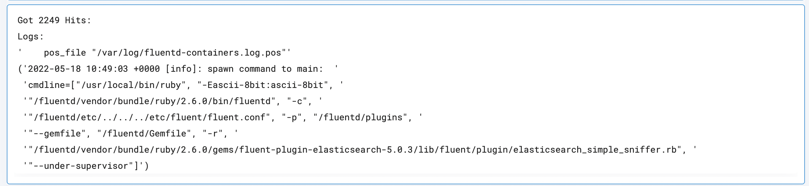

 
<h2>Elasticsearch search using CURL</h2>

 

## Description
This Lego used to Search Elasticsearch using curl command.

## Lego Details

    elasticsearch_search_query_new(handle: object, host: str, api_key: str, port: int,
                                            query: str, index: str, size: int,
                                            fields: List, sort: List)

        handle: Object of type unSkript ElasticSearch Connector
        host: URL of your Elasticsearch server
        port: Port used by your Elasticsearch server
        api_key: API Key for authentication of the request
        query: Query String
        index: Index, Optional variable for the elasticsearch query
        size: Size, Optional variable Size
        sort: Sort, Optional List
        fields: Fields, Optional List

## Lego Input
This Lego take nine inputs handle, host, port, api_key, query, index, size, sort and fields.

## Lego Output
Here is a sample output.

## See it in Action

You can see this Lego in action following this link [unSkript Live](https://us.app.unskript.io)