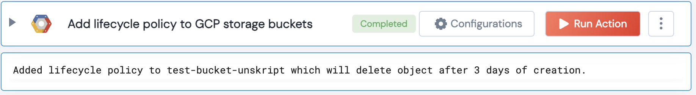

[]
(https://unskript.com/assets/favicon.png)
<h1>Add lifecycle policy to GCP storage bucket</h1>

## Description
The action adds a lifecycle policy to a Google Cloud Platform (GCP) storage bucket.

## Lego Details
	gcp_add_lifecycle_policy_to_bucket(handle, bucket_name:str, age:int)
		handle: Object of type unSkript GCP Connector.
		age: Age (in days) of bucket to add to lifecycle policy.
    	bucket_name: GCP storage bucket name.

## Lego Input
This Lego takes inputs handle, age and bucket_name.

## Lego Output
Here is a sample output.

## See it in Action

You can see this Lego in action following this link [unSkript Live](https://us.app.unskript.io)