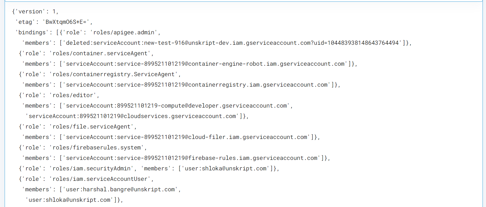

 
<h1>GCP Add Member to IAM Role</h1>

## Description
This Lego add member to the IAM role which alredy available in GCP.

## Lego Details

    gcp_add_member_to_iam_role(handle: object, project_id: str, role: str, member_email:str, version:int)

        handle: Object of type unSkript GCP Connector
        project_id: Name of the project
        role: Permission name assign to member e.g iam.serviceAccountUser
        member_email: Member email which has GCP access e.g test@company.com
        version: Requested Policy Version

## Lego Input
project_id: Name of the project. eg- "unskript-test2"
role: Permission name assign to member e.g iam.serviceAccountUser
member_email: Member email which has GCP access e.g test@company.com
version: Requested Policy Version

## Lego Output
Here is a sample output.

## See it in Action

You can see this Lego in action following this link [unSkript Live](https://us.app.unskript.io)