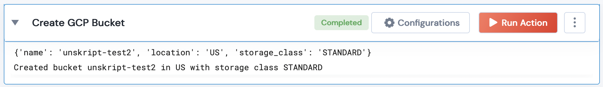

 
<h1>Create GCP Bucket</h1>

## Description
This Lego creates a new GCP bucket.

## Lego Details

    gcp_create_bucket(handle: object, bucket_name: str, location: str, project_name: str,storage_class: str)

        handle: Object of type unSkript GCP Connector
        bucket_name: String, Bucket name
        project_name: String, GCP Project name
        location: String, Location of GCP bucket
        storage_class: String, Storage class to be assigned to the new bucket

## Lego Input
bucket_name": New bucket name. eg- "unskript-test2"
project_name: GCP Project name. eg-  "acme-dev"
storage_class: Storage class to be assigned. eg- "STANDARD"
location: GCP Location. eg- "us"

## Lego Output
Here is a sample output.

## See it in Action

You can see this Lego in action following this link [unSkript Live](https://us.app.unskript.io)