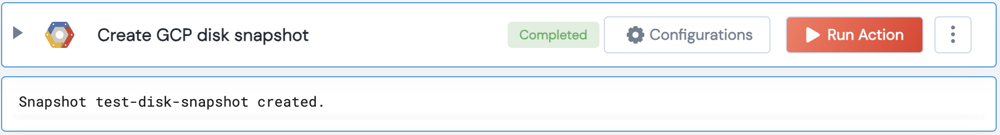

[]
(https://unskript.com/assets/favicon.png)
<h1>Create a GCP disk snapshot</h1>

## Description
Create a GCP disk snapshot.

## Lego Details
	gcp_create_disk_snapshot(handle, project: str, zone:str, disk: str, snapshot_name: str="")
		handle: Object of type unSkript GCP Connector.
		project: Google Cloud Platform Project
		zone: Zone to which the instance list in the project should be fetched.
		disk: The name of the disk to create a snapshot of.
		snapshot_name: The name of the snapshot to create. If not provided, a name will be automatically generated.

## Lego Input
This Lego takes inputs handle, project, zone, disk, snapshot_name.

## Lego Output
Here is a sample output.

## See it in Action

You can see this Lego in action following this link [unSkript Live](https://us.app.unskript.io)