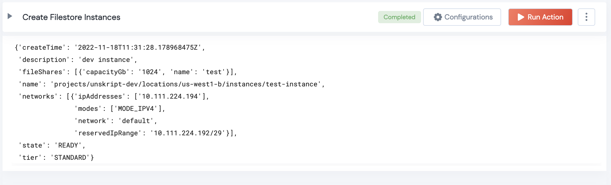

 
<h1>Create GCP Filestore Instance</h1>

## Description
This Lego creates a new GCP Filestore Instance.

## Lego Details

    gcp_create_filestore_instance(handle, instance_id:str, project_name:str, location:str, network:str, tier:str, description:str, name:str, capacity:int )

        handle: Object of type unSkript GCP Connector
        instance_id: String, Name of the instance to create
        project_name: String, GCP Project Name
        location: String, GCP locations map to GCP zones Eg: us-west1-b
        network: String, Name of the Google Compute Engine VPC network
        tier: String, Service tier for instance Eg: STANDARD
        description: String,  Description of the instance (2048 characters or less)
        name: String, Resource name of the instance
        capacity: Integer, File share capacity in gigabytes (GB). Eg: 1024

## Lego Input
instance_id: String, Name of the instance to create Eg: test-instance
project_name: String, GCP Project Name Eg: unskript-project
location: String, GCP locations map to GCP zones Eg: us-west1-b
network: String, Name of the Google Compute Engine VPC network Eg: default
tier: String, Service tier for instance Eg: STANDARD
description: String,  Description of the instance (2048 characters or less)
name: String, Resource name of the instance Eg: unskript-dev
capacity: Integer, File share capacity in gigabytes (GB). Eg: 1024

## Lego Output
Here is a sample output.

## See it in Action

You can see this Lego in action following this link [unSkript Live](https://us.app.unskript.io)