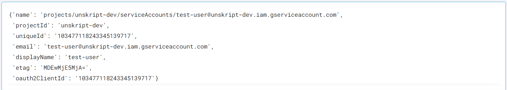

 
<h1>GCP Create Service Account</h1>

## Description
This Lego create service account for GCP.

## Lego Details

    gcp_create_service_account(handle: object, project_id: str, accountId: str, display_name:str)

        handle: Object of type unSkript GCP Connector
        project_id: Name of the project
        accountId: Name for the service account
        display_name: Display Name for the service account

## Lego Input
project_id: Name of the project. eg- "unskript-test2"
accountId: Name for the service account
display_name: Display Name for the service account

## Lego Output
Here is a sample output.

## See it in Action

You can see this Lego in action following this link [unSkript Live](https://us.app.unskript.io)