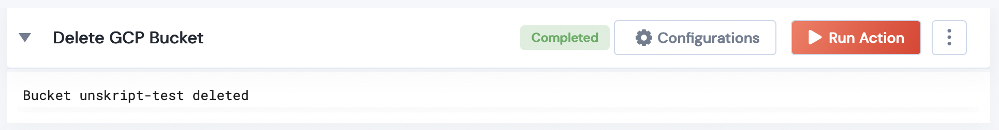

 
<h1>Delete GCP Bucket</h1>

## Description
This Lego deletes a GCP bucket.

## Lego Details

    gcp_delete_bucket(handle: object, bucket_name: str)

        handle: Object of type unSkript GCP Connector
        bucket_name: String, Bucket name

## Lego Input
bucket_name": New bucket name. eg- "unskript-test2"

## Lego Output
Here is a sample output.

## See it in Action

You can see this Lego in action following this link [unSkript Live](https://us.app.unskript.io)