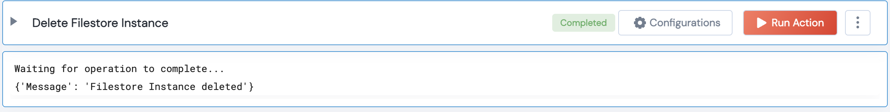

 
<h1>Delete GCP Filestore Instance</h1>

## Description
This Lego deleted a GCP Filestore Instance.

## Lego Details

    gcp_delete_filestore_instance(handle, instance_id:str, project_name:str, location:str)

        handle: Object of type unSkript GCP Connector
        instance_id: String, Name of the instance to create
        project_name: String, GCP Project Name
        location: String, GCP locations map to GCP zones Eg: us-west1-b

## Lego Input
instance_id: String, Name of the instance to create Eg: test-instance
project_name: String, GCP Project Name Eg: unskript-project
location: String, GCP locations map to GCP zones Eg: us-west1-b

## Lego Output
Here is a sample output.

## See it in Action

You can see this Lego in action following this link [unSkript Live](https://us.app.unskript.io)