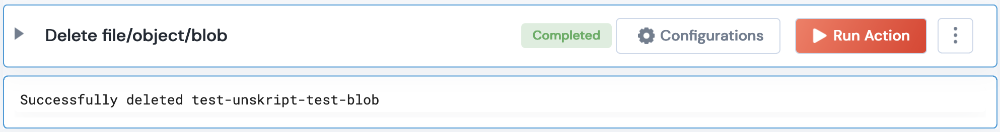

 
<h1>Delete an Object from a GCP Bucket</h1>

## Description
This Lego delete an Object/Blob from a GCP Bucket.

## Lego Details

    gcp_delete_object_from_bucket(handle: object, blob_name: str, bucket_name: str)

        handle: Object of type unSkript GCP Connector
        blob_name: String, Blob Name to be deleted
        bucket_name: String, Bucket name

## Lego Input
blob_name: Blob name. eg- "test-blob"
bucket_name: New bucket name. eg- "unskript-test2"

## Lego Output
Here is a sample output.

## See it in Action

You can see this Lego in action following this link [unSkript Live](https://us.app.unskript.io)