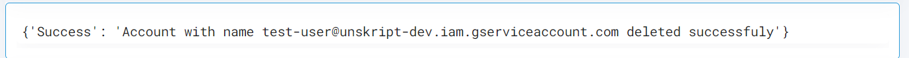

 
<h1>GCP Delete Service Account</h1>

## Description
This Lego delete service account for GCP.

## Lego Details

    gcp_delete_service_account(handle: object, sa_id: str)

        handle: Object of type unSkript GCP Connector
        sa_id: Email of the service account.

## Lego Input
sa_id: Email of the service account

## Lego Output
Here is a sample output.

## See it in Action

You can see this Lego in action following this link [unSkript Live](https://us.app.unskript.io)