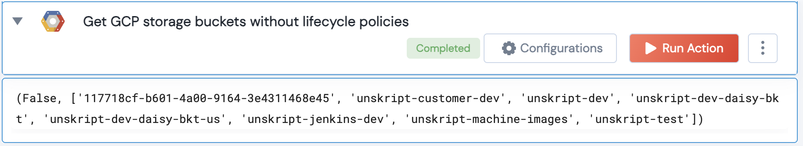

[]
(https://unskript.com/assets/favicon.png)
<h1>Get GCP storage buckets without lifecycle policies</h1>

## Description
The action retrieves a list of Google Cloud Platform (GCP) storage buckets that do not have any lifecycle policies applied.

## Lego Details
	gcp_get_buckets_without_lifecycle_policies(handle)
		handle: Object of type unSkript GCP Connector.

## Lego Input
This Lego takes inputs handle.

## Lego Output
Here is a sample output.

## See it in Action

You can see this Lego in action following this link [unSkript Live](https://us.app.unskript.io)