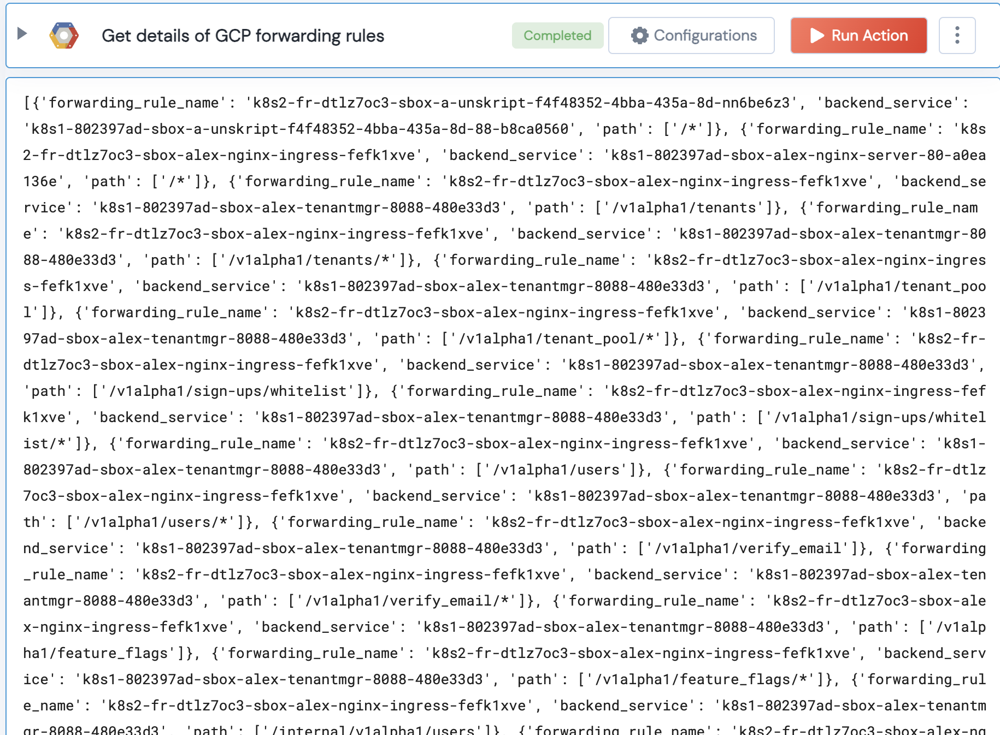

[]
(https://unskript.com/assets/favicon.png)
<h1>Get details of GCP forwarding rules</h1>

## Description
Get details of forwarding rules associated with a backend service.

## Lego Details
	gcp_get_forwarding_rules_details(handle, project: str)
		handle: Object of type unSkript GCP Connector.
		project GCP project ID

## Lego Input
This Lego takes inputs handle, project.

## Lego Output
Here is a sample output.

## See it in Action

You can see this Lego in action following this link [unSkript Live](https://us.app.unskript.io)