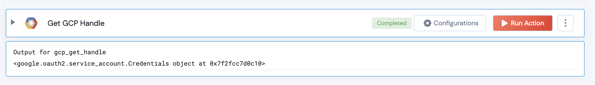

 
<h1>Get GCP Handle</h1>

## Description
This Lego returns the GCP Handle that can be used to access any Google Cloud python APIs.

## Lego Details

    gcp_get_handle(handle: object)

        handle: Object of type unSkript GCP Connector

## Lego Output
Here is a sample output.

## See it in Action

You can see this Lego in action following this link [unSkript Live](https://us.app.unskript.io)
