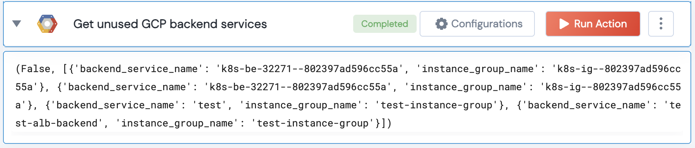

[]
(https://unskript.com/assets/favicon.png)
<h1>Get unused GCP backend services</h1>

## Description
Get unused backend service for an application load balancer that have no instances in it's target groups.

## Lego Details
	gcp_get_unused_backend_services(handle, project: str)
		handle: Object of type unSkript GCP Connector.
		project: GCP project ID.

## Lego Input
This Lego takes inputs handle, project.

## Lego Output
Here is a sample output.

## See it in Action

You can see this Lego in action following this link [unSkript Live](https://us.app.unskript.io)