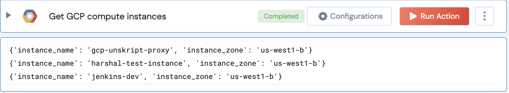

 
<h1>Get GCP Compute Instances</h1>

## Description
This Lego returns the the list of compute instances for a given Project and Zone.

## Lego Details

    gcp_list_compute_instances(handle: object, project: string, zone: string)

        handle: Object of type unSkript GCP Connector
        project: String GCP Project name
        zone: String, Zone in which to get the instnances list from

## Lego Input
 project:  GCP Project name eg. "acme-dev"
 zone: GCP Zone eg. "us-west1-b"

## Lego Output
Here is a sample output.

## See it in Action

You can see this Lego in action following this link [unSkript Live](https://us.app.unskript.io)
