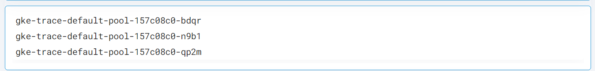

 
<h1>Get List of GCP compute instance by label</h1>

## Description
This Lego get list of GCP compute instance by label.

## Lego Details

    gcp_get_instances_by_labels(handle: object, project: str, zone:str, key: str, value: str)

        handle: Object of type unSkript GCP Connector
        project_name: String GCP Project name
        zone: String, Zone in which to get the instnances list from
        key: GCP label key assigned to instance.
        value: GCP label value assigned to instance.

## Lego Input
 project:  GCP Project name eg. "acme-dev"
 zone: GCP Zone eg. "us-west1-b"
 key: label key
 value: label value

## Lego Output
Here is a sample output.

## See it in Action

You can see this Lego in action following this link [unSkript Live](https://us.app.unskript.io)
