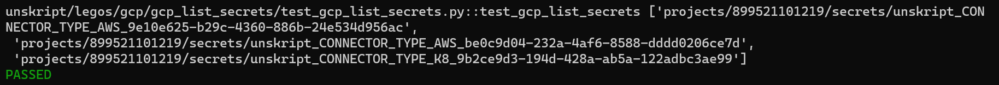

 
<h2>List GCP Secrets</h2>

 

## Description
This Lego List GCP Secrets.

## Lego Details

    gcp_list_secrets(handle: object, name: str)

        handle: Object of type unSkript GCP Connector
        name: Name of the Google Cloud Project.

## Lego Input
This Lego take two inputs handle and name.

## Lego Output
Here is a sample output.

## See it in Action

You can see this Lego in action following this link [unSkript Live](https://us.app.unskript.io)