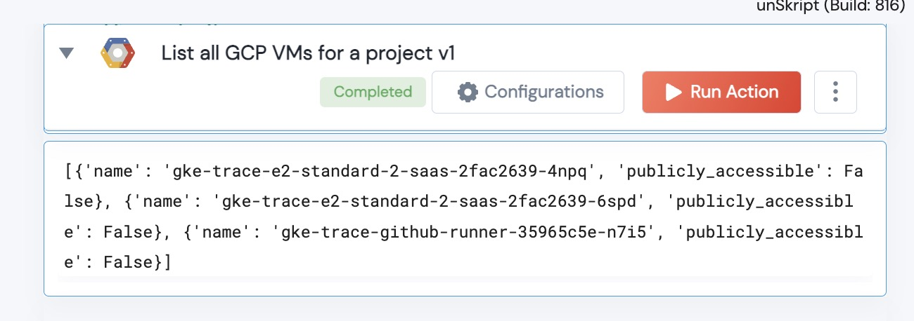

 
<h1>List GCP VMs</h1>

## Description
This Lego lists all available GCP VMs and whether or not the VMs are publicly accessible.

## Lego Details

    gcp_list_(handle: object)

        handle: Object of type unSkript GCP Connector
        bucket_name: String, Bucket name

## Lego Input
None

## Lego Output
Here is a sample output.

## See it in Action

You can see this Lego in action following this link [unSkript Live](https://us.app.unskript.io)