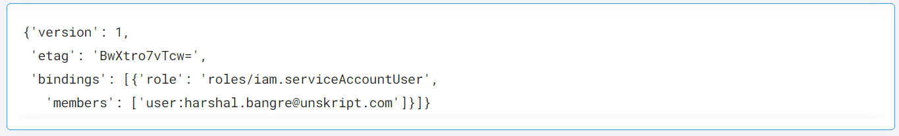

 
<h1>GCP Remove Role from Service Account</h1>

## Description
This Lego remove role and member from the service account in GCP.

## Lego Details

    gcp_remove_role_from_service_account(handle: object, project_id: str, role: str, sa_id:str)

        handle: Object of type unSkript GCP Connector
        project_id: Name of the project
        role: Role name from which member needs to remove e.g iam.serviceAccountUser
        sa_id: Service Account email

## Lego Input
project_id: Name of the project. eg- "unskript-test2"
role: Role name from which member needs to remove e.g iam.serviceAccountUser
sa_id: Service Account email

## Lego Output
Here is a sample output.

## See it in Action

You can see this Lego in action following this link [unSkript Live](https://us.app.unskript.io)