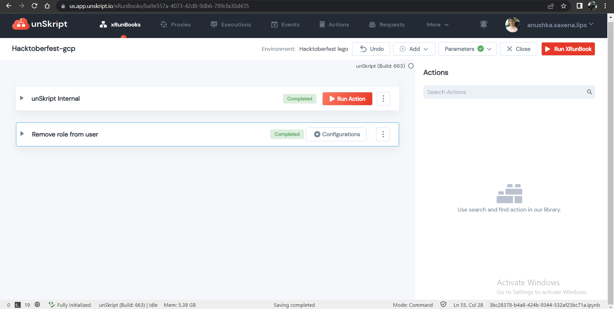

 
<h1>Remove role from user</h1>

## Description
GCP lego for removing a role from a user (default: 'viewer')

## Lego Details
    gcp_remove_user_role(policy, role: str, member: str)
        role: user role to be removed
        member: user's id to be removed

## Lego Input
This Lego takes 2 inputs: role and member.

## Lego Output

confirmation of removal of role.

Tested action on sandbox.

