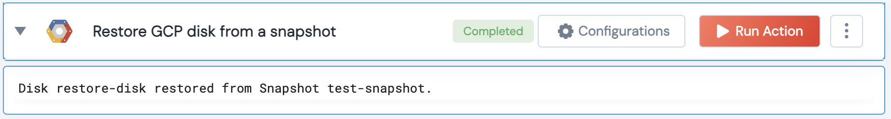

[]
(https://unskript.com/assets/favicon.png)
<h1>Restore GCP disk from a snapshot </h1>

## Description
Restore a GCP disk from a compute instance snapshot.

## Lego Details
	gcp_restore_disk_from_snapshot(handle, project: str, zone: str, disk: str, snapshot_name: str)
		handle: Object of type unSkript GCP Connector.
		project: Google Cloud Platform Project.
		zone: GCP Zone where the disk and snapshot reside.
		disk: The name of the disk to restore.
		snapshot_name: The name of the snapshot to restore from.

	Please refer to README.md file of any existing lego and similarly add the description for your input parameters.

## Lego Input
This Lego takes inputs handle, project, zone, disk, snaoshot_name.

## Lego Output
Here is a sample output.

## See it in Action

You can see this Lego in action following this link [unSkript Live](https://us.app.unskript.io)