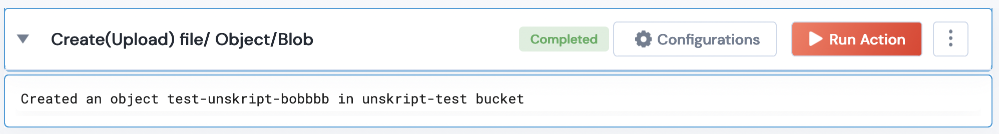

 
<h1>Fetch Objects from GCP Bucket</h1>

## Description
This Lego upload an Object/Blob to a GCP Bucket.

## Lego Details

    gcp_upload_file_to_bucket(handle: object, blob_name: str, bucket_name: str, data: str)

        handle: Object of type unSkript GCP Connector
        blob_name: String, Blob Name to be given
        bucket_name: String, Bucket name
        data: String, String of data to be uploaded to blob/object

## Lego Input
blob_name: Blob name. eg- "test-blob"
bucket_name: New bucket name. eg- "unskript-test2"
data: Data to be uploaded. eg- " dummy data for testing"

## Lego Output
Here is a sample output.

## See it in Action

You can see this Lego in action following this link [unSkript Live](https://us.app.unskript.io)