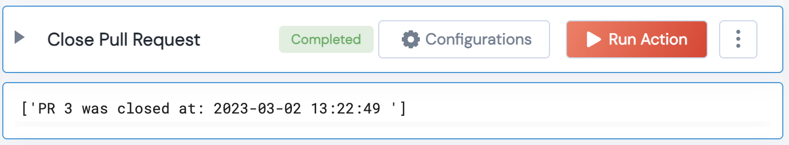

 
<h2>Github Close Pull Requests</h2>

 

## Description
This Lego closes an open pull requests for a user based on PR number

## Lego Details

    github_close_pull_request(handle: object , owner:str, repository:str, pull_request_number)

        handle: Object of type unSkript Github Connector
        owner: String, Username of the GitHub user. Eg: "johnwick"
        repository: String, Full name of the GitHub repository. Eg: "unskript/Awesome-CloudOps-Automation"
        pull_request_number: Int, Pull request number. Eg: 167 

## Lego Input
This Lego take 4 inputs handle, owner, repository, pull_request_number

## Lego Output
Here is a sample output.

## See it in Action

You can see this Lego in action following this link [unSkript Live](https://us.app.unskript.io)