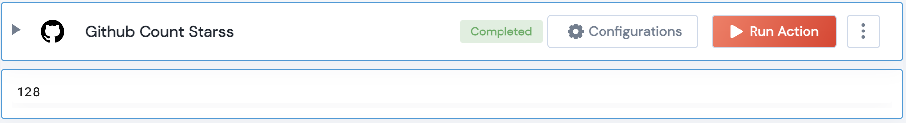

 
<h2>Github Count Stars</h2>

 

## Description
This Lego gets the count of stars on a repository

## Lego Details

    github_count_stars(handle, owner:str, repository:str)

        handle: Object of type unSkript Github Connector
        owner: String, Username of the GitHub user. Eg: "johnwick"
        repository: String, Full name of the GitHub repository. Eg: "unskript/Awesome-CloudOps-Automation"

## Lego Input
This Lego take 3 inputs handle, owner, repository

## Lego Output
Here is a sample output.

## See it in Action

You can see this Lego in action following this link [unSkript Live](https://us.app.unskript.io)