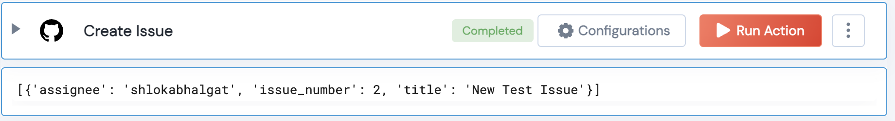

 
<h2>Github Create Issue</h2>

 

## Description
This Lego creates a new Github Issue and returns its details

## Lego Details

    github_create_issue(handle, owner:str, repository:str, title:str, description:str, assignee: str)

        handle: Object of type unSkript Github Connector
        owner: String, Username of the GitHub user. Eg: "johnwick"
        repository: String, Full name of the GitHub repository. Eg: "unskript/Awesome-CloudOps-Automation"
        title: String, Title if the Github Issue
        description: String, Description of the Github Issue
        assignee: String, Username of the Assignee

## Lego Input
This Lego take 6 inputs handle, owner, repository, title, description, assignee

## Lego Output
Here is a sample output.

## See it in Action

You can see this Lego in action following this link [unSkript Live](https://us.app.unskript.io)