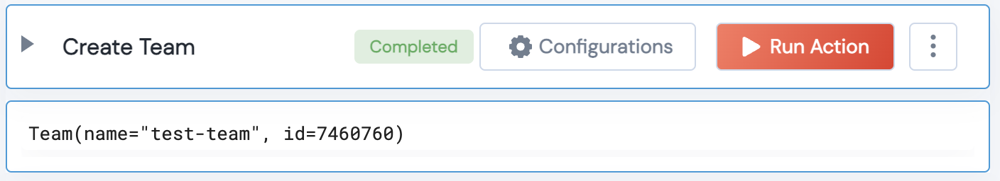

 
<h2>Github Create Team</h2>

 

## Description
This Lego creates a new Github team and returns the details of a team.

## Lego Details

    github_create_team(handle: object, organization_name: str, team_name: str, repositories:list, privacy:str, description:str)

        handle: Object of type unSkript Github Connector
        organization_name: String, Organization Name
        team_name: String, Team Name
        description: Optional String, 
        privacy: Enum, Privacy type to be given to the team. "secret" - only visible to organization owners and members of  this team, "closed"- visible to all members of this organization. By default type "secret" will be considered. 
        repositories: List, List of the GitHub repositories to add to the new team. Eg: ["repo1","repo2"]'

## Lego Input
This Lego take 6 inputs handle, organization_name, team_name, description, privacy, repositories.

## Lego Output
Here is a sample output.

## See it in Action

You can see this Lego in action following this link [unSkript Live](https://us.app.unskript.io)