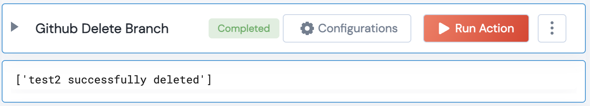

 
<h2>Github Delete Branch</h2>

 

## Description
This Lego deleted a given branch

## Lego Details

    github_delete_branch(handle: object, owner: str, repository: str, branch_name: str)

        handle: Object of type unSkript Github Connector
        owner: String, Username of the GitHub user. Eg: "johnwick"
        repository: String, Name of the GitHub repository. Eg: "Awesome-CloudOps-Automation"
        branch_name: String, Branch Name

## Lego Input
This Lego take 4 inputs handle, owner, repository, branch_name

## Lego Output
Here is a sample output.

## See it in Action

You can see this Lego in action following this link [unSkript Live](https://us.app.unskript.io)