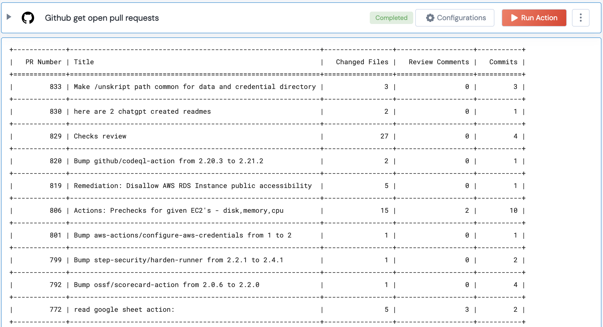

 
<h2>Github Get Team</h2>

 

## Description
This Lego gets checks if a PR is merged

## Lego Details

    github_get_open_pull_requests(handle, repository: str, owner: str = "")

        handle: Object of type unSkript Github Connector
        owner: String, Username of the GitHub user. Eg: "johnwick" (optional)
        repository: String, Full name of the GitHub repository. Eg: "unskript/Awesome-CloudOps-Automation"

## Lego Input
This Lego take 3 inputs handle, owner (optional), repository.

## Lego Output
Here is a sample output.

## See it in Action

You can see this Lego in action following this link [unSkript Live](https://us.app.unskript.io)