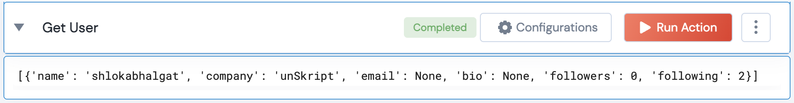

 
<h2>Github Get User</h2>

 

## Description
This Lego Gets user details for the given user.

## Lego Details

    github_get_user(handle: object, owner: str)

        handle: Object of type unSkript Github Connector
        owner: String, Username of the GitHub user. Eg: "johnwick"

## Lego Input
This Lego take 2 inputs handle, owner

## Lego Output
Here is a sample output.

## See it in Action

You can see this Lego in action following this link [unSkript Live](https://us.app.unskript.io)