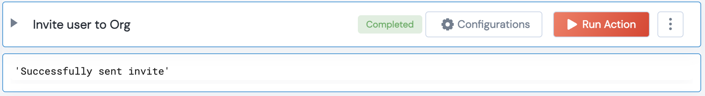

 
<h2>Github invite User to an Organization</h2>

 

## Description
This Lego sends an invite to a user to an organization

## Lego Details

    github_invite_user_to_org(handle, organization_name:str, email:str, list_of_teams:list, role:GithubUserRole=None)

        handle: Object of type unSkript Github Connector
        organization_name: String, Organization Name
        list_of_teams: List of teams to add the user to. Eg:["frontend-dev","backend-dev"]
        email: String, Email address of the user to invite to the Github Organization. Eg: user@gmail.com
        role: Enum, Role to assign to the new user. By default, direct_member role will be assigned. Eg:"admin" or "direct_member" or "billing_manager". 

## Lego Input
This Lego take 5 inputs handle, organization_name, list_of_teams, email, role

## Lego Output
Here is a sample output.

## See it in Action

You can see this Lego in action following this link [unSkript Live](https://us.app.unskript.io)