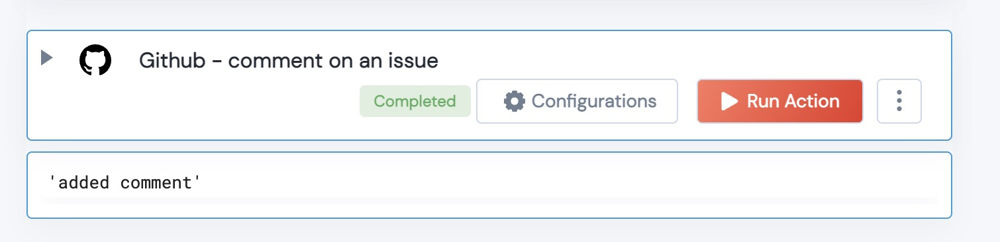
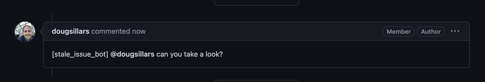

 
<h2>Github Add Comment to an Issue</h2>

 

## Description
This Action adds a comment to the desired issue

## Lego Details

    def github_comment_on_issue(handle, owner:str, repository:str, issue_number:str, issue_comment:str) -> str:

        handle: Object of type unSkript Github Connector
        owner: String, Username of the GitHub user. Eg: "johnwick"
        repository: String, Full name of the GitHub repository. Eg: "unskript/Awesome-CloudOps-Automation"
        issue_number: The issue that you wish to comment on.
        issue_comment: The text to be added as a comment.

## Lego Input
This Lego take 5 inputs handle, owner, repository, issue_number and issue_comment

## Lego Output
Here is a sample output.

## See it in Action

You can see this Lego in action following this link [unSkript Live](https://us.app.unskript.io)