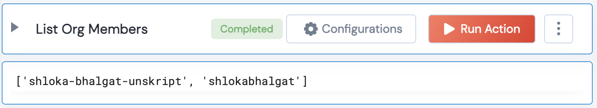

 
<h2>Github List Organization Members</h2>

 

## Description
This Lego lists all organization members

## Lego Details

    github_list_org_members(handle: object ,organization_name:str)

        handle: Object of type unSkript Github Connector
        organization_name: String, Name of Github Organization. Eg: "unskript"

## Lego Input
This Lego take 2 inputs handle, organization_name

## Lego Output
Here is a sample output.

## See it in Action

You can see this Lego in action following this link [unSkript Live](https://us.app.unskript.io)