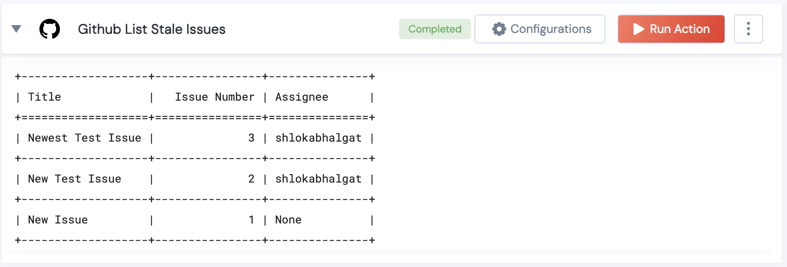

 
<h2>Github List Stale Issues</h2>

 

## Description
This Lego lists all stale issues in a Github Repository

## Lego Details

    github_list_pull_requests(handle: object , owner:str, repository:str, age_to_stale:int)

        handle: Object of type unSkript Github Connector
        owner: String, Username of the GitHub user. Eg: "johnwick"
        repository: String, Full name of the GitHub repository. Eg: "unskript/Awesome-CloudOps-Automation"
        age_to_stale: Integer, Age in days to check if the issue creation or updation dates are older and hence classify those issues as stale Eg:45'

## Lego Input
This Lego take 4 inputs handle, owner, repository, age_to_stale

## Lego Output
Here is a sample output.

## See it in Action

You can see this Lego in action following this link [unSkript Live](https://us.app.unskript.io)