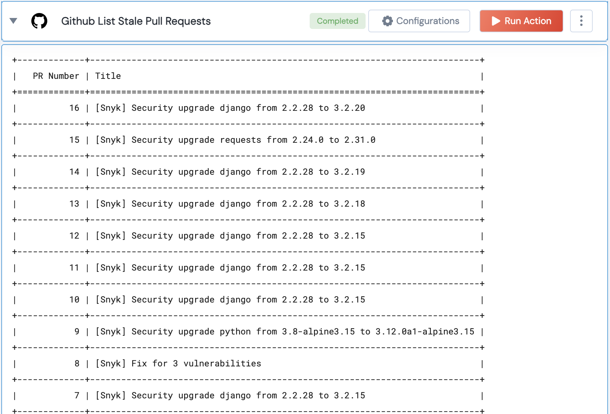

 
<h2>Github List Stale Pull Requests</h2>

 

## Description
This Lego lists stale pull requests

## Lego Details

    github_list_stale_pull_requests(handle: object , owner:str, repository:str, threshold_days:int)

        handle: Object of type unSkript Github Connector
        owner: String, Username of the GitHub user. Eg: "johnwick"
        repository: String, Full name of the GitHub repository. Eg: "unskript/Awesome-CloudOps-Automation"
        threshold_days: Threshold number of days to find stale PR's
    
## Lego Input
This Lego take 4 inputs handle, owner, repository, threshold_days

## Lego Output
Here is a sample output.

## See it in Action

You can see this Lego in action following this link [unSkript Live](https://us.app.unskript.io)