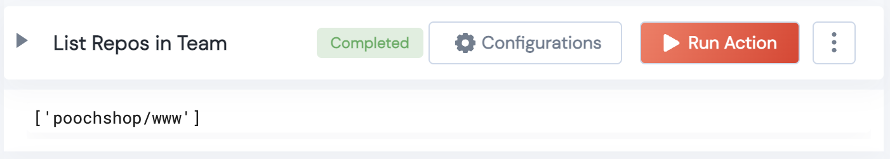

 
<h2>Github List Team Repositories</h2>

 

## Description
This Lego lists Repositories in a Team

## Lego Details

    github_list_team_repos(handle: object, organization_name: str, team_name: str)

        handle: Object of type unSkript Github Connector
        organization_name: String, Organization Name
        team_name: String, Team Name

## Lego Input
This Lego take 3 inputs handle, organization_name, team_name

## Lego Output
Here is a sample output.

## See it in Action

You can see this Lego in action following this link [unSkript Live](https://us.app.unskript.io)