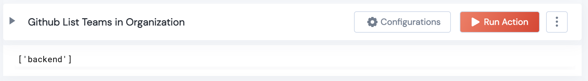

 
<h2>Github List Teams in an Organization</h2>

 

## Description
This Lego gets list of teams in an organization

## Lego Details

    github_list_teams_in_org(handle: object,organization_name:str )

        handle: Object of type unSkript Github Connector
        organization_name: String, Name of the GitHub Organization. Eg: "wheelorg"

## Lego Input
This Lego take 2 inputs handle, owner, repository, organization_name

## Lego Output
Here is a sample output.

## See it in Action

You can see this Lego in action following this link [unSkript Live](https://us.app.unskript.io)