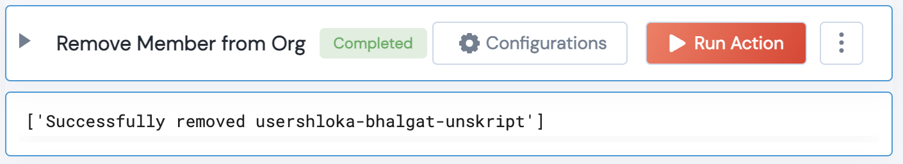

 
<h2>Github Remove Organization Member</h2>

 

## Description
This Lego removes a member from an Organization

## Lego Details

    github_remove_member_from_org(handle: object ,organization_name:str, username:str)

        handle: Object of type unSkript Github Connector
        organization_name: String, Name of Github Organization. Eg: "unskript"
        username: String, Organization member's username. Eg: "jane-mitch-unskript"

## Lego Input
This Lego take 3 inputs handle, organization_name, username

## Lego Output
Here is a sample output.

## See it in Action

You can see this Lego in action following this link [unSkript Live](https://us.app.unskript.io)