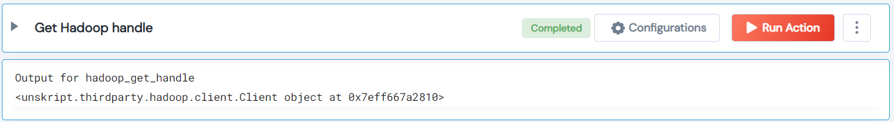

 
<h2>Get Hadoop handle</h2>

 

## Description
This Lego Get Hadoop handle.

## Lego Details

    hadoop_get_handle(handle: object)

        handle: Object of type unSkript Hadoop Connector

## Lego Input
This Lego take one input handle.

## Lego Output
Here is a sample output.

## See it in Action

You can see this Lego in action following this link [unSkript Live](https://us.app.unskript.io)