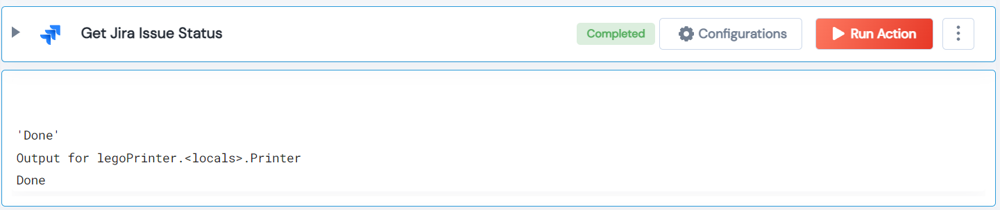

 

<h2>Get Jira Issue Status</h2>

 

## Description
This Lego Get Issue Status from Jira API.

## Lego Details

    jira_get_issue_status(handle: object, issue_id: str)

        handle: Object of type unSkript jira Connector
        issue_id: Issue ID.

## Lego Input
This Lego take two input handle and issue_id.

## Lego Output
Here is a sample output.

## See it in Action

You can see this Lego in action following this link [unSkript Live](https://us.app.unskript.io)