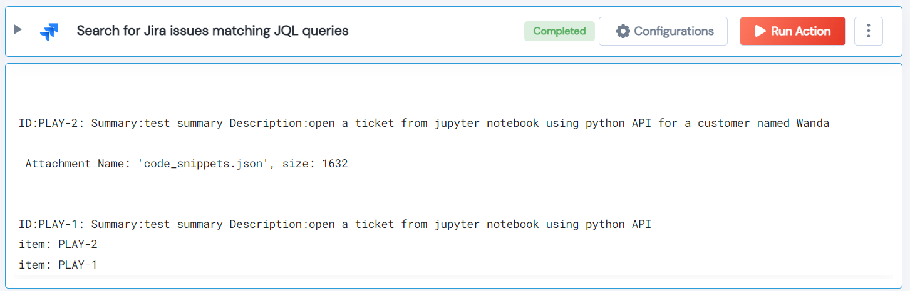

 
<h2>Search for Jira issues matching JQL queries</h2>

 

## Description
This Lego Use JQL to search all matching issues in Jira. Returns a List of the matching issues IDs/keys.

## Lego Details

    jira_search_issue(handle: object, jql: str, max_results: int)

        handle: Object of type unSkript jira Connector
        jql: Search string to execute in JIRA.
        max_results: Max limit on number of matching issues

## Lego Input
This Lego take three input handle, jql and max_results.

## Lego Output
Here is a sample output.

## See it in Action

You can see this Lego in action following this link [unSkript Live](https://us.app.unskript.io)