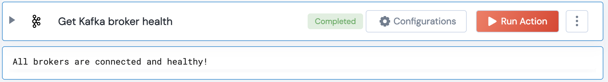

[]
(https://unskript.com/assets/favicon.png)
<h1>Get Kafka broker health</h1>

## Description
Checks the health of the Kafka brokers by determining if the Kafka producer can establish a connection with the bootstrap brokers of a Kafka cluster.

## Lego Details
	kafka_broker_health_check(handle)
		handle: Object of type unSkript KAFKA Connector.

## Lego Input
This Lego takes inputs handle.

## Lego Output
Here is a sample output.

## See it in Action

You can see this Lego in action following this link [unSkript Live](https://us.app.unskript.io)