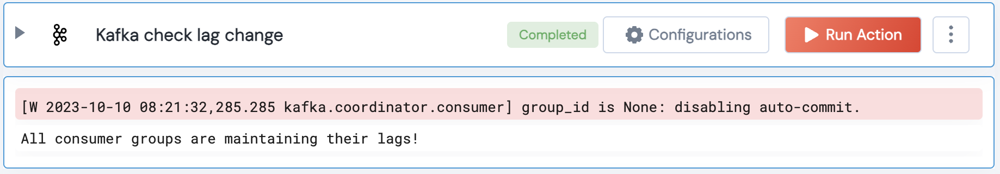

[]
(https://unskript.com/assets/favicon.png)
<h1>Kafka check lag change</h1>

## Description
This action checks if the lag for consumer groups is not changing for a threshold number of hours.

## Lego Details
	kafka_check_lag_change(handle, group_id: str= "", threshold: int=1)
		handle: Object of type unSkript KAFKA Connector.
		group_id: Consumer group ID.
		threshold: The number of hours to check if the lag hasn't changed.

## Lego Input
This Lego takes inputs handle, group_id, threshold.

## Lego Output
Here is a sample output.

## See it in Action

You can see this Lego in action following this link [unSkript Live](https://us.app.unskript.io)