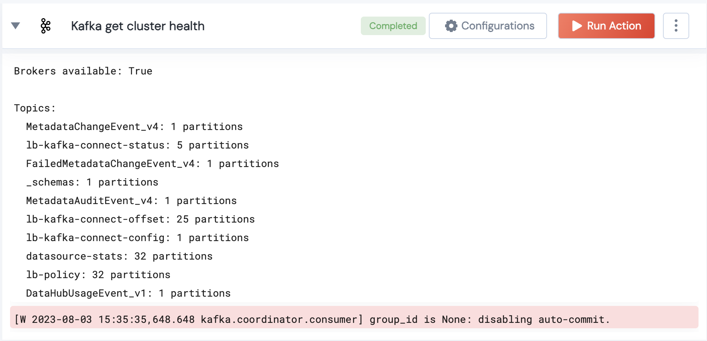

[]
(https://unskript.com/assets/favicon.png)
<h1>Kafka get cluster health</h1>

## Description
Fetches the health of the Kafka cluster including brokers, topics, and partitions.

## Lego Details
	kafka_get_cluster_health(handle: KafkaProducer)
		handle: Object of type unSkript KAFKA Connector.

## Lego Input
This Lego takes inputs handle.

## Lego Output
Here is a sample output.

## See it in Action

You can see this Lego in action following this link [unSkript Live](https://us.app.unskript.io)