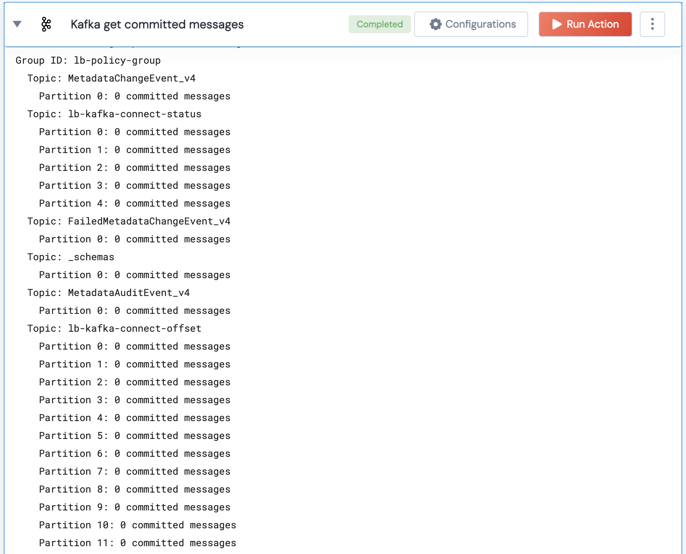

[]
(https://unskript.com/assets/favicon.png)
<h1>Kafka get count of committed messages</h1>

## Description
Fetches the count of committed messages (consumer offsets) for a specific consumer group and its topics.

## Lego Details
	kafka_get_committed_messages_count(handle, group_id: str)
		handle: Object of type unSkript KAFKA Connector.
		group_id: Consumer group ID 

## Lego Input
This Lego takes inputs handle, group_id.

## Lego Output
Here is a sample output.

## See it in Action

You can see this Lego in action following this link [unSkript Live](https://us.app.unskript.io)