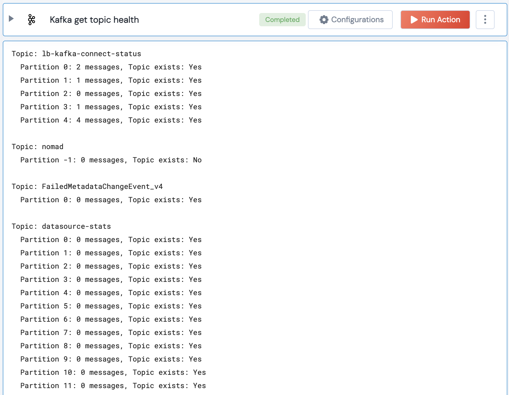

[]
(https://unskript.com/assets/favicon.png)
<h1>Kafka get topic health</h1>

## Description
This action fetches the health and total number of messages for the specified topics.

## Lego Details
	kafka_get_topic_health(handle, group_id: str, topics: list)
		handle: Object of type unSkript KAFKA Connector.
		group_id: Consumer group ID 
		topics: List of topic names.

## Lego Input
This Lego takes inputs handle, group_id, topics.

## Lego Output
Here is a sample output.

## See it in Action

You can see this Lego in action following this link [unSkript Live](https://us.app.unskript.io)