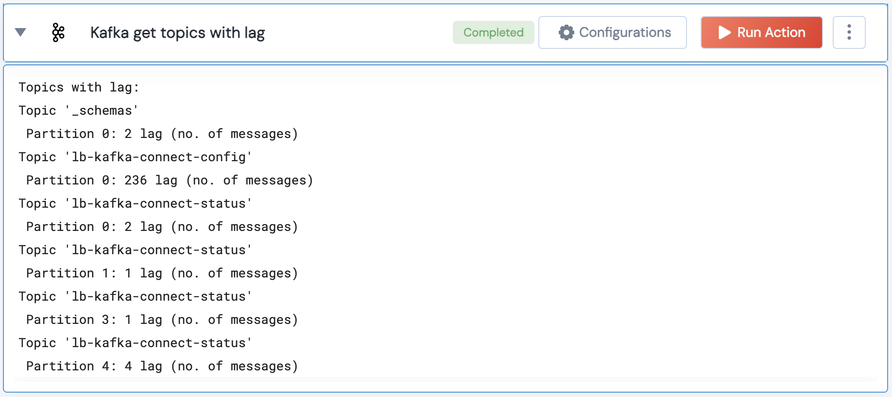

[]
(https://unskript.com/assets/favicon.png)
<h1>Kafka get topics with lag</h1>

## Description
This action fetches the topics with lag in the Kafka cluster.

## Action Details
	kafka_get_topics_with_lag(handle, group_id: str, threshold: int = 2)
		handle: Object of type unSkript KAFKA Connector.
		group_id: Consumer group ID.
		threshold: Lag threshold for alerting.

## Action Input
This Action takes inputs handle, group_id, threshold.

## Action Output
Here is a sample output.

## See it in Action

You can see this Lego in action following this link [unSkript Live](https://us.app.unskript.io)