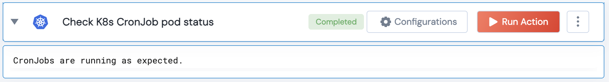
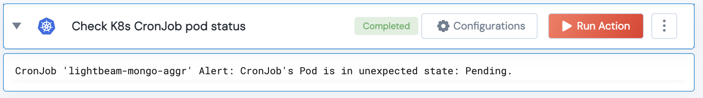

[]
(https://unskript.com/assets/favicon.png)
<h1>Checks the status of CronJob pods</h1>

## Description
This action checks the status of CronJob pods

## Lego Details
	k8s_check_cronjob_pod_status(handle, namespace: str="")
		handle: Object of type unSkript K8S Connector.
		namespace: Namespace where the CronJob is deployed.

## Lego Input
This Lego takes inputs handle namespace(Optional)

## Lego Output
Here is a sample output.

## See it in Action

You can see this Lego in action following this link [unSkript Live](https://us.app.unskript.io)