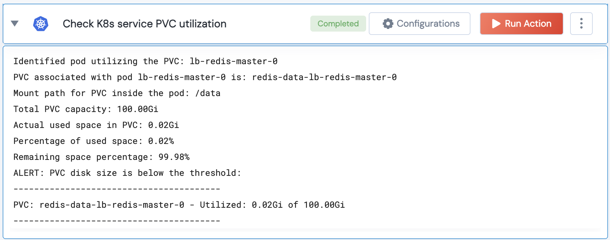

[]
(https://unskript.com/assets/favicon.png)
<h1>Check K8s service PVC utilization </h1>

## Description
This check fetches the PVC associated with a given service, determines its utilized size, and then compares it to its total capacity. If the used percentage exceeds the provided threshold, it triggers an alert.

## Lego Details
	k8s_check_service_pvc_utilization(handle, service_name: str = "", namespace: str = "", threshold: int = 80)
		handle: Object of type unSkript K8S Connector.
    	service_name: The name of the service.
    	threshold: Percentage threshold for utilized PVC disk size. E.g., a 80% threshold checks if the utilized space exceeds 80% of the total PVC capacity.
		namespace: The namespace in which the service resides.

## Lego Input
This Lego takes inputs handle, service_name, namespace, threshold.

## Lego Output
Here is a sample output.

## See it in Action

You can see this Lego in action following this link [unSkript Live](https://us.app.unskript.io)
