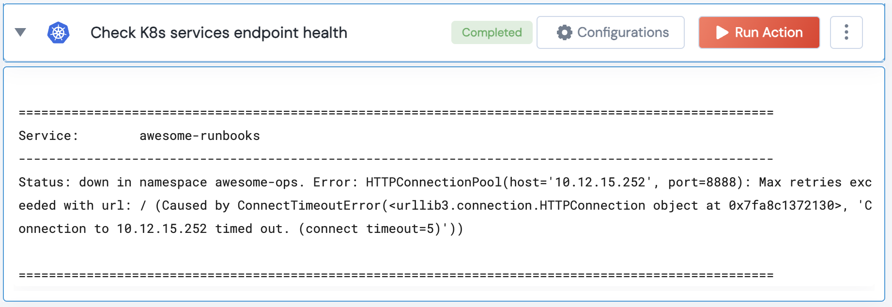

[]
(https://unskript.com/assets/favicon.png)
<h1>Check K8s services endpoint and SSL certificate health</h1>

## Description
Checks the health status of the provided list of endpoints and their SSL certificate status.

## Lego Details
	k8s_check_service_status(handle, endpoints:list=[], threshold: int = 30)
		handle: Object of type unSkript K8S Connector.
		endpoints: The URLs of the endpoint whose SSL certificate is to be checked. Eg: ["https://www.google.com", "https://expired.badssl.com/"]
    	threshold: The number of days within which, if the certificate is set to expire, is considered a potential issue.

## Lego Input
This Lego takes inputs handle, endpoints, threshold.

## Lego Output
Here is a sample output.

## See it in Action

You can see this Lego in action following this link [unSkript Live](https://us.app.unskript.io)